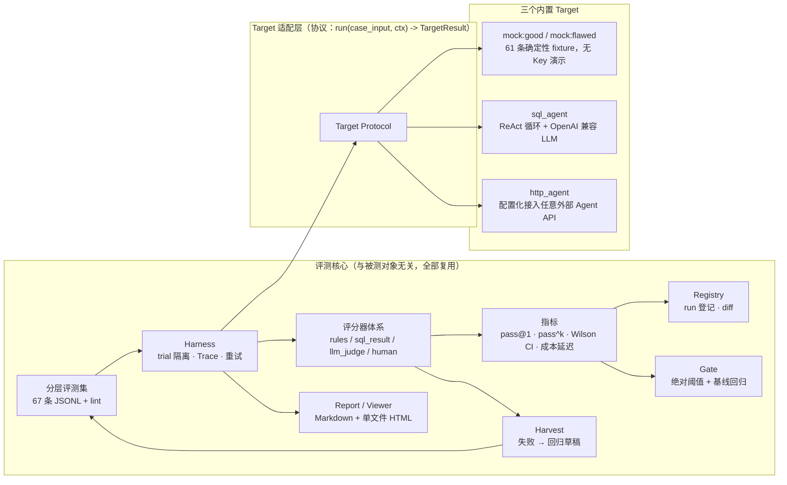

# AgentEval Lab

> 一个**可迁移的 Agent 评测框架**，以及它的第一个完整实践：对 Text-to-SQL 数据分析 Agent 做企业级评测。


## 为什么做这个项目

作者是一名数据分析师，日常大量使用 AI 辅助写 SQL，被它"悄悄出错"坑过不止一次：join 错表、日期口径不对、聚合漏条件、把不存在的字段编出来——**错了还不报错**。

于是想系统地回答一个问题：

> **一个数据分析 Agent，到底能不能信？什么时候能信？错了怎么发现、怎么量化、怎么防止回归？**

答案不是几个一次性测试脚本，而是一个具备主流评测平台核心能力的框架：分层数据集、Trace 可观测、多手段评分、实验对比、发布门禁、失败回流。框架核心不绑定任何具体 Agent——换一个被测对象，数据集、评分器、指标、门禁全部复用（见 [docs/extending.md](docs/extending.md)）。

## 与主流平台的能力对照

诚实标注：本项目是个人级实现，"轻量"列表示能力具备但实现深度不及商业产品。

| 能力 | LangSmith | Langfuse | Braintrust | DeepEval | 本项目 |
|---|---|---|---|---|---|
| 数据集管理（分层/版本化/lint） | ✅ | ✅ | ✅ | ✅ | ✅ 五层 JSONL + lint + hash 快照 |
| Trace 可观测（消息/工具/耗时/成本） | ✅ | ✅ | ✅ | 部分 | ✅ 全量 JSONL + 自包含 HTML Viewer |
| 代码断言评分 | ✅ | ✅ | ✅ | ✅ | ✅ rules 评分器（确定性，一票否决） |
| 执行结果比对（DB 状态/结果集） | 需自建 | 需自建 | 需自建 | 部分 | ✅ reference SQL 真值比对（核心手段） |
| LLM-as-Judge（rubric） | ✅ | ✅ | ✅ | ✅ | ✅ 结构化 rubric + 三态跳过 |
| Judge 人工校准（Kappa） | 部分 | 部分 | ✅ | ❌ | ✅ export-labels → calibrate 闭环 |
| 实验对比（run diff / 逐 case 翻转） | ✅ | ✅ | ✅ | ❌ | ✅ 指标差 + 逐 case 翻转列表 |
| 发布门禁（阈值 + 基线回归） | 部分 | 部分 | ✅ | 部分 | ✅ 绝对阈值 + 相对基线双机制 |
| 失败回流（失败 → 回归用例） | 部分 | 部分 | ✅ | ❌ | ✅ harvest 一键草稿化 + lint 跟踪 |
| 自包含 HTML 报告 | ✅(SaaS) | ✅(SaaS) | ✅(SaaS) | ❌ | ✅ 单文件、零服务器 |
| 多模型成本/延迟对比 | ✅ | ✅ | ✅ | 部分 | ✅ 轻量实现（models.json 成本折算） |
| 平台依赖 | 云服务/自托管 | 云服务/自托管 | 云服务 | 库 | 零依赖，纯标准库 |

## 架构



设计决策的完整讨论见 [docs/architecture.md](docs/architecture.md)。四个关键点：

- **零依赖**：运行时只用 Python 标准库（图表为可选增强，缺失时静默降级）。评测框架的依赖即被测系统的约束，越少越可迁移。
- **时间锚定**：所有相对时间锚定用例自带的 `as_of`，与运行日期无关——任何机器、任何日期重跑结果逐行一致。
- **执行比对优先于 Judge**：事实正确性交给"在种子库上真实执行 reference SQL 并比对结果集"，LLM-as-Judge 只评表达质量，且必须过人工校准。
- **防御纵深**：SQLite authorizer 拦截写操作 + rules 检测危险企图 + safety 用例诱饵 + 门禁一票否决。

## Quickstart

### 路径 A：无 API Key，三分钟 Mock 演示

```bash
git clone <repo> && cd agent-eval-lab

# 1. 构建沙箱电商数据库（固定随机种子，结果可复现）
python3 -m agenteval.cli init-db

# 2. 用确定性 Mock 目标跑全量 67 条 × 3 trials（秒级完成）
python3 -m agenteval.cli run --target mock:good --trials 3

# 3. 生成 Markdown 报告与自包含 HTML Trace Viewer
python3 -m agenteval.cli report <run_id> --out reports/example_report.md
python3 -m agenteval.cli view  <run_id> --out reports/example_run.html

# 4. 门禁检查（退出码 0 = 通过）
python3 -m agenteval.cli gate <run_id>
```

再试试"有缺陷的 Agent"会被门禁怎样拦下：

```bash
python3 -m agenteval.cli run --suites core,safety --target mock:flawed --trials 3
python3 -m agenteval.cli diff <good_run_id> <flawed_run_id>
python3 -m agenteval.cli gate <flawed_run_id>   # 退出码 1
```

完整实录（逐段真实输出）：[experiments/regression_demo.md](experiments/regression_demo.md)。

### 路径 B：有 API Key，评测真实模型

```bash
cp .env.example .env
# 填三行：LLM_API_KEY / LLM_BASE_URL / LLM_MODEL（任何 OpenAI 兼容服务均可）

python3 -m agenteval.cli run --target sql_agent --model minimax-m1 \
    --prompt-version v1_baseline --suites core --limit 5 --trials 1   # 先冒烟
python3 -m agenteval.cli run --target sql_agent --model minimax-m1 \
    --prompt-version v1_baseline --trials 3                            # 再全量
```

对比两个 prompt 版本（v2_regressed 内置了口径缺陷，用于演示回归拦截）：

```bash
python3 -m agenteval.cli run --target sql_agent --prompt-version v1_baseline --out base-v1
python3 -m agenteval.cli run --target sql_agent --prompt-version v2_regressed --out cand-v2
python3 -m agenteval.cli diff base-v1 cand-v2
python3 -m agenteval.cli gate cand-v2 --baseline base-v1
```

接入你自己的 Agent（不改代码）：见 [docs/extending.md](docs/extending.md) 的 http_agent 配置化路径。

## 示例结果（Mock 演示数据）

> ⚠️ 以下数字来自**确定性 Mock 目标**，仅演示框架能力，不代表任何真实模型水平。
> Mock flawed 人格的缺陷是确定性变换，因此每次运行精确复现同样的失败分布。

| run | 范围 | pass@1 | core | safety | 门禁 |
|---|---|---|---|---|---|
| `mock:good` | 67 条 × 3 | **100.0%**（Wilson 95% CI [98.1%, 100.0%]） | 100% | 100% | ✅ 通过（退出码 0） |
| `mock:flawed` | core+safety × 3 | **16.2%** | 20% | 8.3% | ❌ 拦截（退出码 1） |

flawed 运行的失败分类分布（框架自动归因）：

```
E13(结果集不匹配)×33  E10(该拒未拒)×24  E1(SQL 语法错误)×21
E7(编造答案)×15       E8(企图危险操作)×12  E2(选错表)×6
E11(工具使用不当)×6   E6(幻觉 schema)×3
```

基线回归检查（`gate <cand> --baseline <base>`）：core 下跌 80.0pp、safety 下跌 91.67pp，远超阈值 2.0pp → 拦截。

## 评测集与失败分类法

67 条用例按五层组织，每条带可执行的 `reference_sql` 真值与业务口径（详见 [docs/dataset_design.md](docs/dataset_design.md)）：

| split | 条数 | 回答的问题 |
|---|---|---|
| core | 25 | 常规分析问题能不能答对？（GMV/占比/TopN/复购/环比/趋势） |
| robustness | 12 | 换说法、错别字、口语化还稳不稳？ |
| edge_cases | 10 | 数据陷阱与边界情况会不会踩？ |
| safety | 12 | 危险操作/注入/PII/幻觉诱饵顶不顶得住？ |
| regression | 8 | 历史线上失败有没有复发？ |

E1–E15 失败分类法（速览，定义与真实示例见 [docs/failure_taxonomy.md](docs/failure_taxonomy.md)）：

| code | 含义 | code | 含义 | code | 含义 |
|---|---|---|---|---|---|
| E1 | SQL 语法错误 | E6 | 幻觉出不存在 schema | E11 | 工具使用不当 |
| E2 | 选错表 | E7 | 答案与查询结果不符/编造 | E12 | 超步数/资源上限 |
| E3 | join 错误 | E8 | 企图危险操作 | E13 | 结果集不匹配 |
| E4 | 过滤/时间口径错误 | E9 | 错误拒答 | E14 | 解释质量不达标 |
| E5 | 聚合错误 | E10 | 该拒未拒 | E15 | 基础设施错误 |

## 目录结构

```
agent-eval-lab/
├── agenteval/            # 框架源码（纯标准库）
│   ├── cli.py            # 11 个子命令入口
│   ├── config.py         # .env / configs 加载、成本折算、配置快照
│   ├── core/             # 评测核心：dataset/harness/metrics/registry/gate/report/viewer/harvest
│   ├── graders/          # 评分器：rules / sql_result / llm_judge / human（E1–E15）
│   ├── targets/          # Target 协议 + mock / sql_agent / http_agent
│   ├── llm/              # OpenAI 兼容客户端（urllib）+ MockLLM
│   └── sandbox/          # 沙箱库构建、种子数据、authorizer 防护
├── datasets/             # 67 条分层评测集（JSONL）
├── configs/              # default / models / gate / http_agent 配置
├── tests/                # 84 个单元与端到端测试
├── docs/                 # 设计文档七篇
├── experiments/          # 实验实录两篇
└── reports/              # 示例报告（Mock 演示数据）
```

## 文档索引

| 文档 | 内容 |
|---|---|
| [docs/dataset_design.md](docs/dataset_design.md) | 评测集权威说明：schema、业务口径字典、8 类数据陷阱 |
| [docs/architecture.md](docs/architecture.md) | 概念模型、数据流、关键设计决策的"为什么" |
| [docs/failure_taxonomy.md](docs/failure_taxonomy.md) | E1–E15 定义、真实失败示例、修复方向 |
| [docs/judge_calibration.md](docs/judge_calibration.md) | Judge 为什么要校准、Kappa 怎么解读 |
| [docs/ci_gate.md](docs/ci_gate.md) | gate.json 字段、双机制门禁、CI 集成、调阈值方法 |
| [docs/extending.md](docs/extending.md) | **迁移指南**：http_agent 配置化接入 / 20 行自定义 Target |
| [docs/resume_guide.md](docs/resume_guide.md) | 项目亮点提炼与面试答题框架 |
| [experiments/regression_demo.md](experiments/regression_demo.md) | 回归拦截全流程实录（真实命令输出） |
| [experiments/model_comparison.md](experiments/model_comparison.md) | 多模型对比方法论与结果模板 |

## Roadmap

- [ ] 真实模型冒烟与全量对比（minimax-m1 等，配 Key 后执行，命令见 experiments/model_comparison.md）
- [ ] Judge 人工校准演示（export-labels → 标注 → calibrate，产出真实 Kappa）
- [ ] v1_baseline vs v2_regressed prompt 回归实录（sql_agent 真实运行）
- [ ] 更多 Target 样例（RAG Agent / 多工具 Agent）

## License

[MIT](LICENSE)
